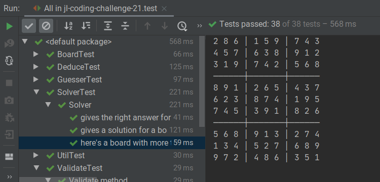

# John Lewis Coding Challenge 21

It solves Sudokus.

<https://coding-challenges.jl-engineering.net/challenges/challenge-21/>

Build with `./gradlew build`

Run with `./gradlew run`

Run the tests with `./gradlew test`