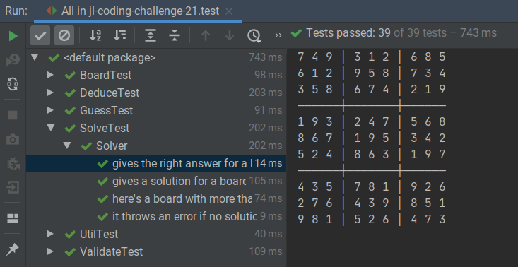

# John Lewis Coding Challenge 21

It solves Sudokus.

<https://coding-challenges.jl-engineering.net/challenges/challenge-21/>

## Thoughts etc.

### TDD

I didn't really TDD this - I couldn't work out how. Instead I planned my algorithm out in advance, then built up various functions I thought I would need (finding a square's row, column and subgrid, applying the rules to make deductions, making valid guesses...) in a test-first way, and then when I had the functions I needed I put them together to make an algorithm to solve the puzzles. So I think I ended up with reasonable test coverage, although the tests did not drive my design.

How would you even go about doing that?

Designing the algorithm up front I think meant I ended up with a more complex solution than necessary. Would it have been simpler to just brute force it, and then maybe iterated the rule-based deductions afterwards?

### Algorithm

Speaking of algorithms, here's what I did:
1. Repeatedly apply this basic rule to all cells until it results in no more changes: if a cell has only one possible option which doesn't appear in its peer group (row, column, subgrid), then fill that option into the cell.
2. If the puzzle is complete, stop.
3. Otherwise find the first cell with the minimum number of possibilities and guess that it's the lowest of the possibilities.
4. Repeat from 1, but if at any point you find that the board has got into an invalid state, go back to your last guess, and replace it with the next possibility for that cell. If there are no more possibilities, go back to the last guess before that one, and so on. If you run out of guesses to go back to, the puzzle was impossible.

Where a puzzle has more than one solution, this will only find one of them. Could improve on this by representing the history of guesses as a tree rather than a list...

### FP

I *think* I've done this all in a functional style, i.e. all my functions are pure (no side effects, apart from `Board.print()`), and all my variables are immutable. It felt like this made the solution much more convoluted that it would have been otherwise, but maybe that was just me...

One thing I was stuck on for a while was how achieve certain looping structures in a functional style, something like calling a function its own output in  a `while` loop. In a non-functional style (imperative?) I would have repeatedly assigned the output of the function to a mutable variable and then passed it back in to the function in a loop or something. I managed to achieve something similar instead by having the function recursively call itself. Seems obvious now. I used Kotlin's `tailrec` modifier to do this safely, just like Ricardo taught me.

### Problems

My algorithm needed a record of the guess history, so it could go back and change guesses where they have proved to be wrong. But I ended up putting things in there which are not guesses, like the initial state of the board, and the final solution. This all seems a bit messy, and I think contributes to the muddle in `Solve.kt`. `deduceAndGuessUnlessSolved()` and `deduceAndGuess()` - surely there must be a better way?